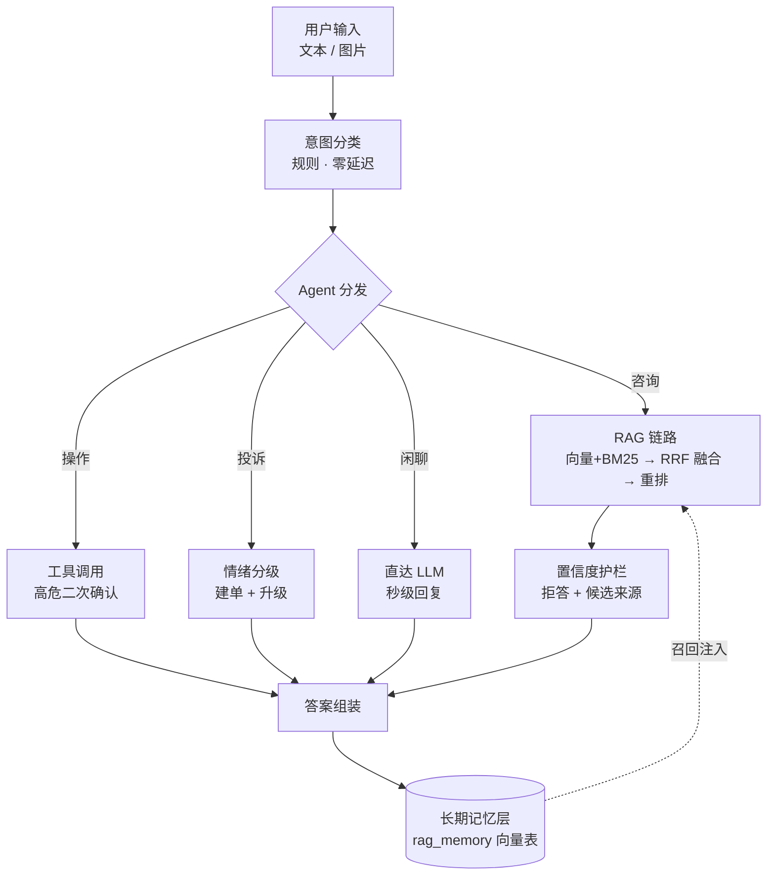

# Mira 智答 · 基于 RAG 的多模态智能客服系统


> 意图路由 Agent 分流（咨询 / 操作 / 投诉 / 闲聊）· 多模态图片理解（qwen-vl）· 混合检索（向量 + BM25/RRF 融合 + 重排序）· GraphRAG 关系推理 · 置信度护栏 · 会话与长期记忆 · 4 级降级

一个面向企业客服场景的**生产级 RAG 智能体系统**：用户消息经意图分类后分发至专职 Agent，咨询类问题走混合检索增强生成链路，图片输入由视觉大模型结合知识库综合作答，投诉自动建单升级，高危操作强制二次确认。

---

## ✨ 核心特性

**🧭 多 Agent 智能分流** — 规则意图分类（零延迟），四路专职 Agent：

| Agent | 能力 |
|---|---|
| 🔍 咨询 | 混合检索 → 融合重排 → 生成 → 来源引用 |
| 🛠️ 操作 | 文档查询直执行；高危操作（删除）强制二次确认 |
| 🎫 投诉 | 情绪三级判定 → 自动建工单 → 高情绪升级人工 |
| 💬 闲聊 | 跳过检索直达 LLM，秒级轻量回复 |

**🖼️ 多模态输入** — 图片经 qwen-vl 视觉理解，结合知识库片段综合作答（OCR 纯文字提取作为兜底链路）。

**🔎 混合检索** — 向量（LanceDB）+ BM25 关键词召回，RRF 融合 + 自适应加权，rerank 分数归一化融合；跨库兜底与选择性扇出。

**🛡️ 答案置信度护栏** — 分数下限拒答 + 生成前低相关前置拦截（带语义下限防误拒），拒答时附候选来源与引导追问，宁可拒答不编造。

**🧠 记忆层** — 短期：会话滑动窗口；长期：用户历史向量存储（按用户隔离，答后异步写入，问前召回注入上下文）。

**📉 可观测与降级** — 分阶段延迟拆解、QA 质量近似指标（faithfulness/confidence）、LLM 熔断器、4 级降级（跳重排 → 仅 BM25 → LLM 兜底）。

## 📊 质量门禁与评测基线

| 指标 | 数值 |
|---|---|
| 测试套件 | **534 passed / 0 failed** |
| 生产对齐召回 Recall@10（n=80，10 知识库） | **1.00** |
| Recall@1 / Recall@3 / MRR | 0.71 / 0.91 / 0.82 |
| 离线 390 问门禁 | 融合+自适应 α，Recall@1 +4.3pp |
| 知识库就绪 | 10 库全部有语料、可检索、可路由，探针 broken=0 |

四层可复跑门禁：`make test-ci`（覆盖率 ≥80%）· `make eval-routing`（黄金路由题）· `make eval-gate`（390 问召回基线比对）· `make eval-kb`（KB 级生产对齐评测）。

## 🏗️ 架构



## 🚀 快速开始

```bash
git clone git@github.com:UniqueDevJing/Mira.git
cd Mira
pip install -e ".[dev]"

# 配置 .env (最小集)
cat > .env <<EOT
RAG_LLM_BASE_URL=https://dashscope.aliyuncs.com/compatible-mode/v1
RAG_LLM_MODEL=qwen-plus
RAG_LLM_VL_MODEL=qwen-vl-plus
RAG_LLM_API_KEY=sk-xxx
RAG_API_KEY=your-api-key
RAG_API_KEY_ENABLED=true
EOT

# 启动
uvicorn api.main:app --host 0.0.0.0 --port 8000
# 前端: http://127.0.0.1:8000/web/
```

## 🔌 API 示例

```bash
# 文本问答（流式）
curl -X POST http://127.0.0.1:8000/api/v1/qa/ask/stream \
  -H "Content-Type: application/json" -H "X-API-Key: YOUR_KEY" \
  -d '{"question": "七天内可以无理由退款吗"}'

# 图片提问（纯图片，视觉模型理解）
curl -X POST http://127.0.0.1:8000/api/v1/qa/ask \
  -H "Content-Type: application/json" -H "X-API-Key: YOUR_KEY" \
  -d '{"question": "", "image_base64": "<base64>"}'

# 指定 Agent / 确认高危操作
curl -X POST http://127.0.0.1:8000/api/v1/qa/ask \
  -d '{"question": "删除文档 <doc_id>", "force_agent": "operation",
       "confirm_operation": true, "pending_operation_id": "OP..."}'
```

## 📁 项目结构

```
api/            FastAPI 应用 · 路由 · 编排 · 多Agent · 记忆层 · 护栏
engines/        检索(向量/BM25/融合/重排) · 图谱 · 分块 · 路由 · 文档类型
web/            零依赖原生 JS 前端 (流式 SSE + Agent 切换条 + 工单卡片)
scripts/        评测(gate/routing/kb) · 守护启动 · 入库 · 闭环探针
tests/          534 用例 · PDF fixtures · 评测回归
.github/        CI (test-ci + eval-routing + recall-gate)
```

## 📄 License

[MIT](LICENSE)
